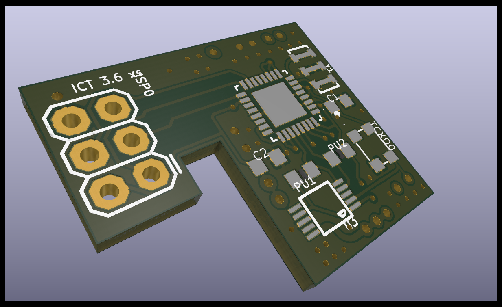

# PCB-ict-xs-KiCad

The ICT tracker KiCad PCB imported from @micked99's Eagle version

Based on original ict_v361-xs, using the QFN/MLF version of the 328p.

Software for this board: https://github.com/kareiva/ICT-v5-ATGM336

